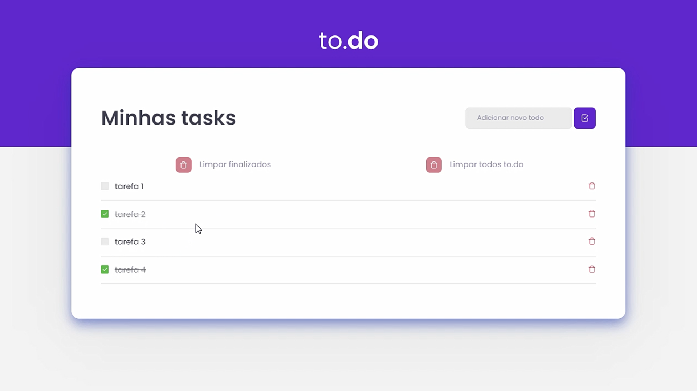

<h1 align="center">🔗 to.Do List</h1>

<a src="https://github.com/Rocketseat">Rocketseat's</a> first challenge on the Ignite React track 🚀 

<figure>
  
</figure>

  <h2>Abaut the challenge</h2>
  
In this challenge, an application was created to train the main concepts of ReactJS.

  
This application has as the main objective allow the user to create activities to do.

  
  <h2>Main requirements of the challenge</h2>
  <ul>
    <li>Add a new task</li>
    <li>Remove a task</li>
    <li>Mark and unmark a task as completed</li>
  </ul>
  
   <h2>Incremented requirements</h2>
  <ul>
    <li>Remove all tasks at once</li>
    <li>Remove all completed tasks at once</li>
  </ul>
  
  <h2>Technologies used in the project</h2>
  <ul>
    <li>ReactJS</li>
    <li>TypeScript</li>
    <li>HTML5</li>
    <li>CSS3</li>
    <li>SASS</li>
  </ul>
  

